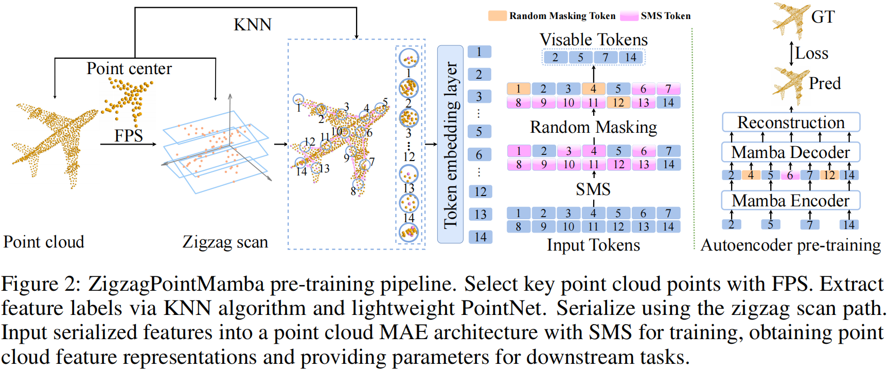
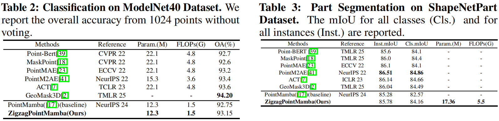
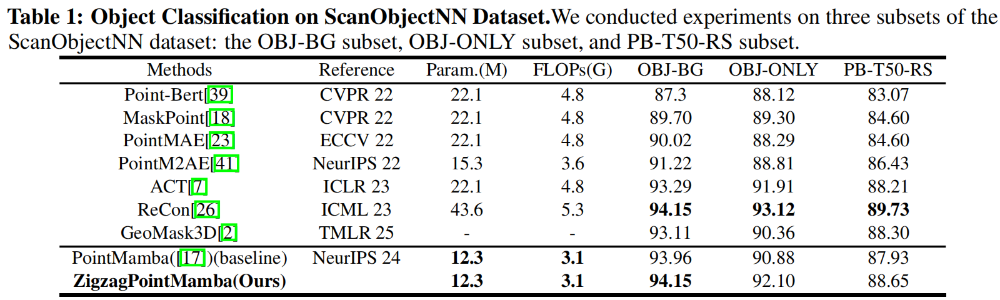

# ZigzagPointMamba: Spatial-Semantic Mamba for Point Cloud Understanding
<div align='center'>
    <a href='mailto:107552304043@stu.xju.edu.cn' target='_blank'>Linshuang Diao</a><sup>1</sup> 
    <a href='mailto:songsensen@stu.xju.edu.cn' target='_blank'>Sensen Song</a><sup>1†</sup> 
    <a href='mailto:qyr@stu.xju.edu.cn' target='_blank'>Yurong Qian</a><sup>2</sup> 
    <a href='mailto:rdyedu@gmail.com' target='_blank'>Dayong Ren</a><sup>3†</sup>
</div>
<div align='center'>
    <sup>1</sup>Key Laboratory of Signal Detection and Processing, Xinjiang University   
    <sup>2</sup>Joint International Research Laboratory of Silk Road Multilingual Cognitive Computing, Xinjiang University   
    <sup>3</sup>Department of Computer Science and Technology, Nanjing University  
    <br>
    <sup>†</sup>Corresponding authors
</div>
<br>
<div align="center">
  <!-- 本地路径：确保 Markdown 与 ZigzagPointMamba_html 同级，点击打开网页 -->
  <a href="https://Rabbitttttt218.github.io/ZigzagPointMamba/ZigzagPointMamba_html/index.html" target="_blank"></a>  
  <a href="https://arxiv.org/abs/2505.21381"></a>  
  <a href="https://github.com/Rabbitttttt218/ZigzagPointMamba"></a>  
  <a href="https://arxiv.org/pdf/2505.21381.pdf"></a>  
</div>
<p align="center">
  
</p>


## Abstract
State Space models (SSMs) like PointMamba provide efficient feature extraction for point cloud self-supervised learning with linear complexity, surpassing Transformers in computational efficiency. However, existing PointMamba-based methods rely on complex token ordering and random masking, disrupting spatial continuity and local semantic correlations. We propose <strong>ZigzagPointMamba</strong> to address these challenges. The key to our approach is a simple zigzag scan path that globally sequences point cloud tokens, enhancing spatial continuity by preserving the proximity of spatially adjacent point tokens. Yet, random masking impairs local semantic modeling in self-supervised learning. To overcome this, we introduce a Semantic-Siamese Masking Strategy (SMS), which masks semantically similar tokens to facilitate reconstruction by integrating local features of original and similar tokens, thus overcoming dependence on isolated local features and enabling robust global semantic modeling. Our pre-training ZigzagPointMamba weights significantly boost downstream tasks, achieving a 1.59% mIoU gain on ShapeNetPart for part segmentation, a 0.4% higher accuracy on ModelNet40 for classification, and 0.19%, 1.22%, and 0.72% higher accuracies respectively for the classification tasks on the OBJ-BG, OBJ-ONLY, and PB-T50-RS subsets of ScanObjectNN.
## 🎉NEWS
+ [2025.09.19] 🎊 **Accepted to NeurIPS 2025**! Our paper <strong>ZigzagPointMamba: Spatial-Semantic Mamba for Point Cloud Understanding</strong> has been accepted to the 39th Annual Conference on Neural Information Processing Systems.
+ [2025.05.27] 🔥 Our paper "<strong>ZigzagPointMamba: Spatial-Semantic Mamba for Point Cloud Understanding</strong>" is available on arXiv! [arXiv:2505.21381](https://arxiv.org/abs/2505.21381)

## 📊 Experimental Results
### Key Visualizations
#### Zigzag Path & Masking
<p align="center"></p>

#### Comprehensive Results
<p align="center"></p>

#### ModelNet40 & ShapeNetPart
<p align="center"></p>

#### Few-shot Learning
<p align="center"></p>

#### ScanObjectNN Results
<p align="center"></p>

## Getting Started

### Datasets

See [DATASET.md](DATASET.md) for details.

### Usage

See [USAGE.md](USAGE.md) for details.

## 📚 Citation
```bibtex
@inproceedings{diao2025zigzagpointmamba,
  title={ZigzagPointMamba: Spatial-Semantic Mamba for Point Cloud Understanding},
  author={Diao, Linshuang and Song, Sensen and Qian, Yurong and Ren, Dayong},
  booktitle={Advances in Neural Information Processing Systems (NeurIPS)},
  volume={39},
  year={2025}
}
